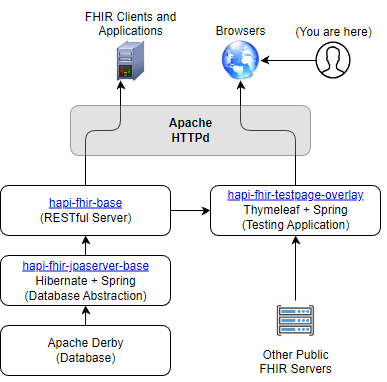

# HAPI FHIR Architecture


# HAPI FHIR Docker Server
- Docker implementation of HAPI FHIR server with postgres persistence layer.
- Customize docker-compose.yml file as follows:
```docker
services:
  fhir:
    container_name: fhir-local
    image: "hapiproject/hapi:latest"
    ports:
      - "8888:8888"
    configs:
      - source: hapi
        target: /app/config/application.yaml
    depends_on:
      - db

  db:
    image: postgres
    restart: always
    environment:
      POSTGRES_PASSWORD: admin
      POSTGRES_USER: admin
      POSTGRES_DB: hapi
    volumes:
      - ./hapi.postgress.data:/var/lib/postgresql/data

configs:
  hapi:
     file: ./hapi.application.yaml
```
- Include a hapi.application.yaml file in the root directory
```docker
spring:
  datasource:
    url: 'jdbc:postgresql://db:5432/hapi'
    username: admin
    password: admin
    driverClassName: org.postgresql.Driver
  jpa:
    properties:
      hibernate.dialect: ca.uhn.fhir.jpa.model.dialect.HapiFhirPostgresDialect
      hibernate.search.enabled: false
```

# HAPI FHIR Local Server
- Local server implementation of Docker requires installation of HAPI server once cloned from HAPI Server Starter repo [here](https://github.com/hapifhir/hapi-fhir-jpaserver-starter).
- Ensure to have dependencies such as:
    - Oracle Java (JDK) installed: Minimum JDK17 or newer.
    - Apache Maven build tool (newest version)
- Once repo is cloned you will have to install dependencies using `mvn install`.
- Run server locally using `mvn spring-boot:run`
- The default port is `80` with the url as [*`http://localhost:8080/fhir/swagger-ui/`*](http://localhost:8080/fhir/swagger-ui/)
- You can configure the port based on application.yaml file found at ``/src/main/resources/application.yaml``
